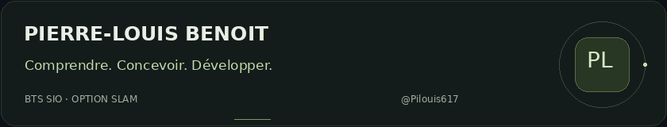

  <picture>
    <source media="(prefers-reduced-motion: reduce)" srcset="assets/header-static.png">
    
  </picture>

  <a href="#à-propos">À propos</a> &nbsp; / &nbsp;
  <a href="#compétences">Compétences</a> &nbsp; / &nbsp;
  <a href="#ma-démarche">Ma démarche</a> &nbsp; / &nbsp;
  <a href="https://github.com/Pilouis617?tab=repositories">Dépôts ↗</a>

## À propos

**Pierre-Louis Benoit · Étudiant en BTS SIO, option SLAM.**

Je me forme au développement d’applications, de l’interface aux bases de données. Mon objectif : comprendre ce que je construis et rendre son utilisation simple pour les autres.

Ce GitHub accompagne mon apprentissage : du code que j’écris, que je teste et que j’améliore au fil de ma formation.

## Compétences

**Mon environnement d’apprentissage et de pratique.**

| Domaine | Technologies | Ce que je travaille |
| :--- | :--- | :--- |
| **Interfaces web** | HTML · CSS · JavaScript | Structure, mise en page et interactions |
| **Applications** | Java · PHP | Logique métier et programmation orientée objet |
| **Données** | MySQL · SQL | Organisation et manipulation des données |
| **Outils** | Git · GitHub · Eclipse · XAMPP | Développement local et suivi des versions |

## Ma démarche

### 01 — Comprendre le besoin
Définir ce que l’application doit faire avant de commencer à coder.

### 02 — Construire avec clarté
Avancer par étapes, choisir des noms explicites et organiser le code pour pouvoir le relire.

### 03 — Tester et affiner
Vérifier le résultat, comprendre les erreurs et améliorer ce qui peut l’être.

---

  <strong>Un code lisible. Une intention claire.</strong> 
  Pierre-Louis Benoit &nbsp; · &nbsp; <a href="https://github.com/Pilouis617">@Pilouis617</a>

